<!--
  ────────────────────────────────────────────────────────────────────────────
   If you are reading this, you already think like an attacker. Recon pays off.
   Source-code review is the first phase of any serious assessment — nice habit.

   Here is a flag for the curious:   dvdknaap{v13w_s0urc3_r3c0n_p4ys_0ff}

   Built with intent: every animation here is pure declarative SVG (CSS/SMIL).
   No JavaScript runs in a GitHub README — the sanitizer strips it. So the
   "XSS popup" further down is, of course, a harmless static image. Or is it.
  ────────────────────────────────────────────────────────────────────────────
-->

  

 

---

## `~$ whoami`

I am a full-time Penetration Tester and Bug Bounty Hunter specializing in advanced web exploitation, custom offensive tooling, and deep-dive infrastructure assessments. I do not rely solely on off-the-shelf scanners; I architect asynchronous, context-aware frameworks to exploit complex logic flaws, race conditions, and deserialization vulnerabilities in modern, high-latency environments.

When a target resists the standard toolkit, I build the tool that breaks it.

---

## `~$ ls ./certifications`

- **HTB Certified Web Exploitation Expert (CWEE):** Passed — the advanced, fully hands-on benchmark for grey/white-box web exploitation.
- **HTB Certified Penetration Testing Specialist (CPTS):** Full-scope network and AD penetration testing.
- **HTB Certified Web Exploitation Specialist (CWES):** Bug-bounty and web app testing _(formerly CBBH, renamed by HTB in October 2025)._
- **PortSwigger Web Security Academy:** **100%** of labs solved, every module completed, both practice exams passed.
- **Continuous R&D:** Developing pure-logic payloads and runtime-first architectures to bypass modern WAFs and EDRs.

---

## `~$ ls ./arsenal --private`

A selection of my proprietary frameworks and utilities, built to automate complex attack chains, bypass filters, and maximize assessment velocity.

| Tool | Category | Core Capability |
| :--- | :--- | :--- |
| **Chronos** | `Concurrency & Timing` | Asynchronous last-byte synchronization for race conditions and high-precision time-based fuzzing. |
| **BitSQL** | `Database Exploitation` | Universal async framework for advanced blind SQLi (BEUSTQ), dynamic WAF evasion, and out-of-band RCE. |
| **Blinj** | `Blind Injection` | Runtime-first payload architecture (Node.js, PHP, Python) for byte-accurate extraction without OS piping. |
| **ProtoMap** | `AST & Logic Flaws` | Automated discovery and exploitation of server/client-side prototype pollution and HTTP parameter pollution. |
| **GQLMap** | `API Security` | High-velocity GraphQL enumeration, security auditing, and intelligent introspection fuzzing. |
| **Polyglot Serializer** | `Deserialization` | Interactive multi-language (PHP, Python, Ruby, Java) gadget orchestration and OOB blind RCE shell. |
| **Juggler** | `Fuzzing Engine` | Context-aware type-juggling fuzzer with high-performance local magic-hash bruteforcing. |
| **Cryptmap** | `Cryptography` | Offline CLI for dynamic payload encoding, hashing, and AES-CBC encryption. |

---

## `~$ cat ./burp_extensions.md`

- **Burp Content Viewer:** A native extension that automatically detects, prettifies, and visualizes complex HTTP responses (minified JSON/XML, raw CSV tables, PDF rendering, EXIF metadata extraction) directly inside the message editor.
- **OOB Collaborator Export:** A professional extension featuring an embedded Tailwind CSS web dashboard and a JSON API to export out-of-band interactions into local automation pipelines — keeping the Burp Scanner logs pristine.

---

## `~$ cat ./tech_stack.txt`

---

## `~$ ./stats --live`

 

 

<picture>
  <source media="(prefers-color-scheme: dark)" srcset="https://raw.githubusercontent.com/dvdknaap/Dvdknaap/output/snake-dark.svg">
  <source media="(prefers-color-scheme: light)" srcset="https://raw.githubusercontent.com/dvdknaap/Dvdknaap/output/snake-light.svg">
  
</picture>

---

## `~$ inject --payload ""`

<b>Reflected XSS proof-of-concept — click to expand</b>

 

---

## `~$ ./connect`

&nbsp;&nbsp;&nbsp;

 

The best findings are the ones nobody else bothered to look for. The same goes for this page — the real recon starts in the source.
